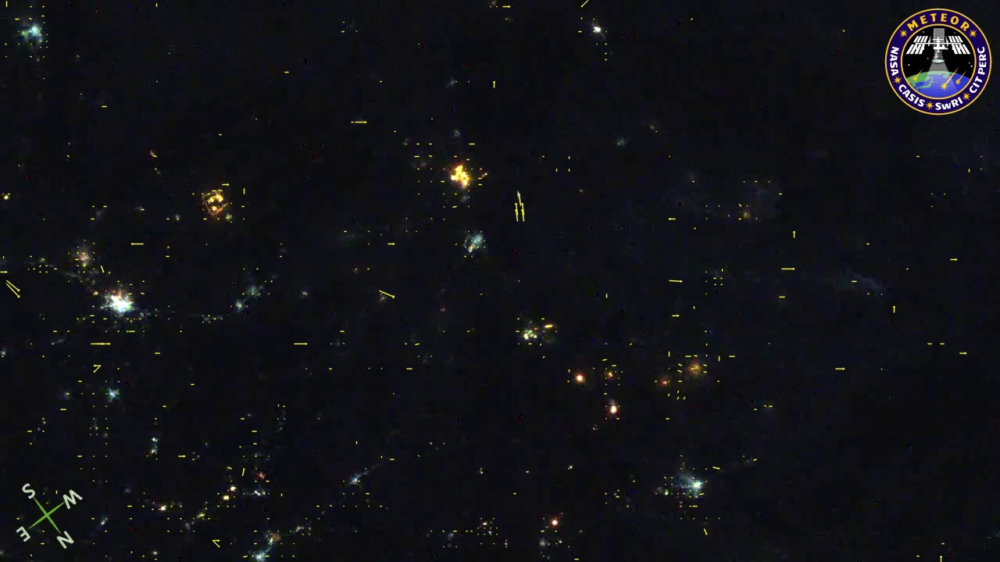

# Motion Vector Extractor (MVE) - Détection de Météores

## Introduction
Ce projet implémente un algorithme de détection des météores basé sur l'extraction et le filtrage des vecteurs de mouvement à partir de vidéos compressées en **H.264** ou **MPEG-4**. Il s'inscrit dans la mission **Meteorix**, un CubeSat universitaire dédié à l'étude des météoroïdes et des débris spatiaux.

L'objectif est d'utiliser l'information contenue dans la compression vidéo pour identifier les météores de manière efficace.

## Fonctionnalités
- Extraction des **vecteurs de mouvement** à partir de vidéos compressées (H.264, MPEG-4)
- Filtrage des vecteurs pour isoler les météores
  - Suppression du bruit par un **seuil de norme**
  - Regroupement des vecteurs proches avec **Nearest Neighbors**
  - Sélection des trajectoires rectilignes
- Utilisation de **FFMPEG** et de l'outil **Motion Vector Extractor (MVE)**
- Encodage des vidéos avec **accélération GPU**

## Utilisation
### Filtrage des Vecteurs
Appliquez les filtres pour isoler les météores :
```bash
python3 src/mvextractor/__main2__.py input.mp4 --dump
```
### Compression Vidéo
Pour compresser des images ppm en une vidéo mp4 :
```bash
ffmpeg -hwaccel cuda -framerate ? -i dossier/image%d.ppm -c:v ? -preset ? -pix_fmt ? -b:v ? -g ? output.mp4 -loglevel verbose
```
- -c:v h264_nvenc (H.264) -c:v hevc_nvenc (H.265)
- -framerate : Nombre d'image par seconde (par défaut, 25)
- -preset : Modifie la compression mais change la qualité en conséquent (plus le preset est faible, meilleure la compression sera)
- -g : Change la fréquence des images clés (par défaut, framerate*10)
- -b:v : Change le bitrate (constant)
- -cq 23 -rc vbr : Adapte la compression selon la qualité de l'image et de donner plus de bits aux parties en mouvements
- -pix_fmt : format des pixels (yuv420p, yuv444p, gray)

## Exemples de Résultats
<p align="center">
  
  
</p>

\centering
### Comparaison Avant/Après Filtrage

## Contributeurs
- **[Cyprien Renaud]**
- **[Anès Abdou]**
- **[Loïc Huang]**


